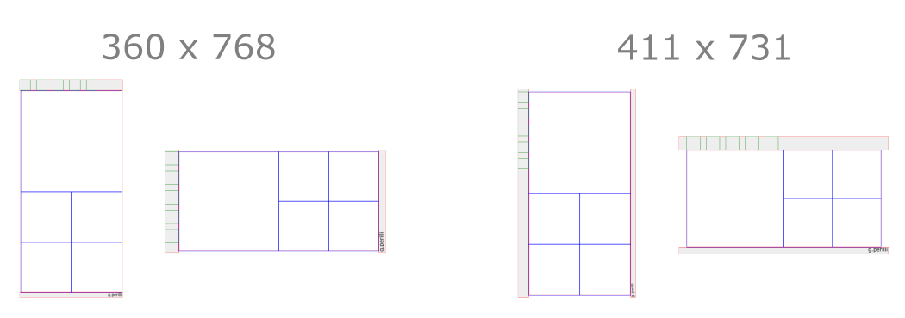

# 2SqreWFrme
 

[2SqreWFrme](https://gperilli.github.io/2SqreWFrme/index.html) is a highly responsive wire frame coded directly into HTML, CSS, and Javascript. 2 squares, and two columns are given sizes, and absolute positions after calculating the screen's width and height. At certain breakpoints the javascript code will decide whether to stack the squares for portrait mode, or place them side by side. Then, the code will decide whether to put the columns above and below, or to the sides of these two squares. The wire frame can potentially scale up and down without limits but the squares in the UI column are given absolute sizes, and there is an upper width limit for larger laptop and desktop screens.

# Licence & Permissions

2SqreWFrme is not commercial. My code is under the CC BY-NC-SA 4.0 licence. Please use it, share it, change it etc.. If it still resembles my code, attribute it.

[Gareth Perilli](https://gperilli.github.io/port/index.html)
